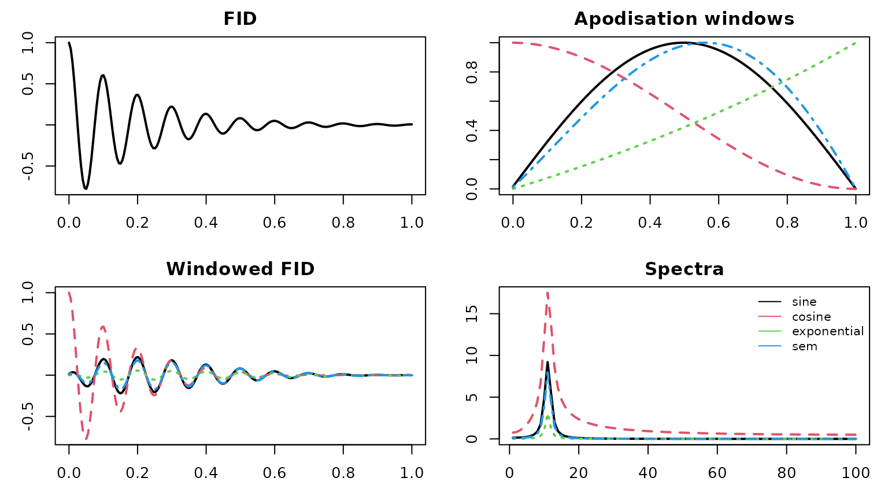
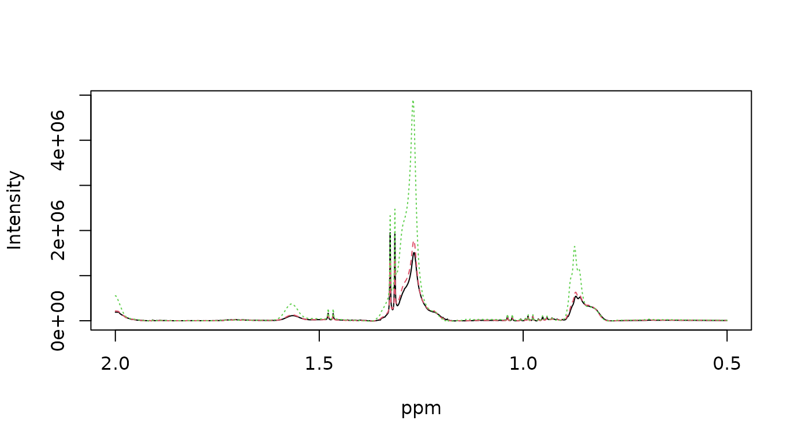
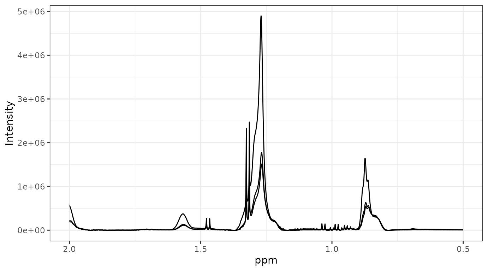
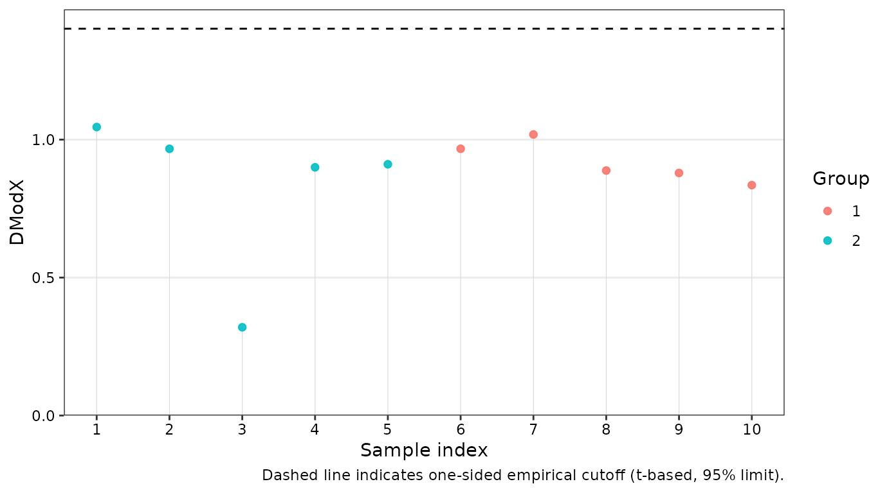

# Getting Started

## Introduction

This vignette demonstrates data import and preprocessing workflow for
NMR-based metabolomics with **metabom8**.

``` r
library(metabom8)
```

## Importing spectral data

In routine high-throughput NMR workflows, raw time-domain data (the
free-induction decay) are typically processed directly on the
spectrometer using the vendor software TopSpin. Downstream metabolomics
analysis therefore commonly starts from frequency-domain spectra.
Consequently, this vignette focuses on importing spectra generated by
TopSpin.

For completeness and teaching purposes, the section ([Starting point:
raw FID](#import-fid)) briefly illustrates importing and transforming
time domain data to obtain spectra.

### TopSpin-processed spectra

The function
[`read1d_proc()`](https://tkimhofer.github.io/metabom8/reference/read1d.md)
imports TopSpin-processed 1D NMR spectra from the `pdata` subdirectory
of Bruker experiment folders (typically `pdata/1`). It reads the
processed absorption-mode spectrum (e.g. `1r`) together with associated
acquisition (`acqus`) and processing (`procs`) parameters.

At minimum two arguments are required:

- `path`: path to the directory that encloses NMR experiments
- `exp_type`: list of spectrometer parameters to filter desired
  experiment types based on acquisition and processing metadata.

Further details on supported filtering options are provided in
[`?read1d_proc`](https://tkimhofer.github.io/metabom8/reference/read1d.md).

``` r
## Example: import 1D spectra
exp_dir <- system.file("extdata", package = "metabom8")
exp_type <- list(pulprog="noesygppr1d")

nmr_data <- read1d_proc(exp_dir, exp_type, n_max = 100)
#> Imported 2 spectra.

names(nmr_data)
#> [1] "X"    "ppm"  "meta"
```

Both import functions
([`read1d_proc()`](https://tkimhofer.github.io/metabom8/reference/read1d.md)
and
[`read1d_raw()`](https://tkimhofer.github.io/metabom8/reference/read1d_raw.md))
return a named list containing three core components used throughout
this vignette: the spectral matrix (`X`), the chemical-shift axis
(`ppm`), and associated metadata (`meta`).

For interactive exploration, setting `to_global = TRUE` assigns the
components `X`, `ppm`, and `meta` directly to the global environment
(`.GlobalEnv`). Existing objects with these names will be overwritten.

The row names of `X` and `meta` correspond to experiment directories and
can be used to join external sample annotations. The `meta` data frame
contains full TopSpin acquisition and processing parameters for each
spectrum.

Example acquisition and processing parameters as they appear in `meta`:

| Prefix | Meaning                | Examples                                    |
|:-------|:-----------------------|:--------------------------------------------|
| a\_    | Acquisition parameters | a_PULPROG, a_SFO1, a_RG, a_SW_h, a_TE       |
| p\_    | Processing parameters  | p_WDW, p_LB, p_SI, p_PHC*, p_BC*, p_NC_proc |

See `?read1d_proc()` for further details.

### Raw FID data

For completeness, `metabom8` also provides functionality to import and
process raw FIDs. This allows users to reproduce basic spectral
processing steps within R or to explore how different processing
parameters influence the resulting spectra.

Processing an FID converts the time-domain signal into a
frequency-domain spectrum. Typical processing steps include
digital-filter correction (group-delay), apodisation (windowing),
zero-filling, Fourier transformation, phase correction.

The function
[`read1d_raw()`](https://tkimhofer.github.io/metabom8/reference/read1d_raw.md)
performs these operations:

``` r
# import 1D NMR data
nmr_raw <- read1d_raw(
  exp_dir,
  exp_type,
  apodisation = list(fun = "exponential", lb = 0.2),
  zerofil = 1L,
  mode = "absorption"
  )
#> Processing 2 experiments.

names(nmr_raw)
#> [1] "X"    "ppm"  "meta"
```

The following examples illustrate several commonly used apodisation
profiles implemented internally in `metabom8`.

``` r
# selected FID apodisation functions
f_apod <- c("sine","cosine","exponential","sem")

# create toy fid
n <- 200; t <- seq(0,1,len=n)
fid <- exp(-5*t)*cos(20*pi*t)

# apply apodisation
A  <- sapply(f_apod, \(f) metabom8:::.fidApodisationFct(n, list(fun=f, lb=-0.2)))
Fp <- sweep(A, 1, fid, `*`)
S  <- apply(Fp, 2, \(x) Mod(fft(x))[1:(n/2)])

# compare graphically
cols <- 1:ncol(A)

par(mfrow=c(2,2), mar=c(3,3,2,1))
plot(t, fid, type="l", lwd=2, main="FID")
matplot(t, A, type="l", lwd=2, col=cols, main="Apodisation windows")
matplot(t, Fp, type="l", lwd=2, col=cols, main="Windowed FID")
matplot(S, type="l", lwd=2, col=cols, main="Spectra")

legend("topright", f_apod, col=cols, lty=1, bty="n", cex=.8)
```



### Visual inspection

Spectra can be visualised with the function
[`plot_spec()`](https://tkimhofer.github.io/metabom8/reference/plot_spec.md).
The minimum set of arguments include the spectral data `X` (array or
matrix) and the chemical shift vector `ppm`.

Three plotting backends are available: `"plotly"` (default), `"base"`,
and `"ggplot2"`. The `"plotly"` backend is set up to use WebGL, enabling
smooth interactive graphics even when the number of data spectra is
large. The `"ggplot2"` backend is not iteractive and renders much
slower. However, the returned object integrates with the extensive
`"ggplot2"` ecosystem and can be further customised to generate
publication-quality figures.

See
[`?plot_spec`](https://tkimhofer.github.io/metabom8/reference/plot_spec.md)
for additional details.

``` r
data("covid", package = "metabom8")

## plot directly from the dataset object
plot_spec(covid, shift = c(0.5, 2))
```

``` r

## alternatively extract data components: X, ppm
X <- covid$X
ppm <- covid$ppm

dim(X)
#> [1]    10 27819
head(ppm)
#> [1] 4.549818 4.549513 4.549207 4.548902 4.548596 4.548291

plot_spec(X[1:3, ], ppm, shift = c(0.5, 2)) # backend='plotly' by default
```

``` r
plot_spec(X[1:3, ], ppm, shift = c(0.5, 2), backend='base')
```



``` r
plot_spec(X[1:3, ], ppm, shift = c(0.5, 2), backend='ggplot2')
```



## Preprocessing

`metabom8` provides a modular preprocessing API for 1D NMR spectra. Each
preprocessing function is composable and designed to support both
interactive exploration and reproducible pipelines.

For a list of preprocessing functions call
[`list_preprocessing()`](https://tkimhofer.github.io/metabom8/reference/list_preprocessing.md)
from the R console.

### Pipeline-style usage

When operating on a `metabom8`-style dataset object, preprocessing
functions return the same structured object: a named list containing the
elements `X`, `ppm`, and `meta`. This allows steps to be chained using
the base R pipe operator (`|>`):

``` r
data("hiit_raw", package = "metabom8") # urine NMR (HIIT exercise experiment)

names(hiit_raw) # X, ppm, meta
#> [1] "X"    "ppm"  "meta"

# piped preprocessing 
hiit_proc <- hiit_raw |> 
  calibrate(type = "tsp") |>
  excise() |>
  correct_baseline(method='asls') |>
  align_spectra() |>
  pqn()

dim(hiit_proc$X)
#> [1]     3 54009
```

This API design enables clear, declarative workflows suitable for
production analyses.

``` r
plot_spec(hiit_raw, shift = c(4,4.1))
```

``` r
plot_spec(hiit_proc, shift = c(4,4.1))
```

### Stepwise execution

Each operation can also be applied independently to a spectral matrix
and ppm vector. This explicit alternative is useful for pipeline
development, parameter tuning and visual inspection.

``` r
X <- hiit_raw$X
ppm <- hiit_raw$ppm

# perform TSP calibration
X_cal <- calibrate(X, ppm, type='tsp')

# excise chemical shift regions
regions <- list(
      upfield_noise   = c(min(ppm), 0.25),
      residual_water  = c(4.5, 5.2),
      downfield_noise = c(9.7, max(ppm))
    )
X_exi <- excise(X_cal, ppm, regions)
ppm_exi <- attr(X_exi, 'm8_axis')$ppm

# baseline correction
X_bli <- correct_baseline(X_exi)

# plot spectrum
plot_spec(X_bli[1,], ppm_exi, shift = c(0,10))
```

### Provenance

Data provenance refers to the documented record of how data were
generated, processed, and transformed. Recording this information
ensures that analyses remain reproducible and that individual
preprocessing steps can be inspected, verified, or repeated at a later
stage.

In `metabom8`, particular emphasis is placed on transparent
preprocessing, as these decisions can substantially influence downstream
statistical analyses and biological interpretation. Each preprocessing
operation automatically records its parameters and execution context as
structured metadata attached to the spectral matrix `X`.

The resulting dataset therefore remains self-describing: the complete
processing history is linked to the data matrix and can be inspected
programmatically at any time.

``` r

## Inspect preprocessing steps
print_provenance(hiit_proc)
#> metabom8 processing pipeline:
#> ==============================
#> [1] calibrate
#>      params:
#>         target :
#>             mode   : singlet
#>             window : [-0.2, 0.2]
#>             centre : 0
#>      notes: Chemical shift calibration applied.
#> 
#> [2] excise1d
#>      params:
#>         regions :
#>             upfield_noise   : [-5.21794, 0.25]
#>             water           : [4.5, 5.2]
#>             urea            : [5.5, 6]
#>             downfield_noise : [9.7, 14.8037]
#>      notes: Specified chemical shift regions removed using get_idx().
#> 
#> [3] baseline
#>      params:
#>         method : asls
#>         args   :
#>      notes: Baseline correction applied.
#> 
#> [4] align spectra
#>      params:
#>         half_win_ppm  : 0.007
#>         n_intervals   : 86
#>         lag.max       : 200
#>         intervals_ppm : <86 items> [[9.68427, 9.66121], [9.46736, 9.44216], [9.29139, 9.27764], ...]
#>      notes: Median-derived chemical shift intervals aligned independently using cross-correlation.
#> 
#> [5] pqn
#>      params:
#>         ref_index  : 
#>         total_area : FALSE
#>         bin        : 
#>      notes: Probabilistic quotient normalisation applied.

# Retrieve specific step
get_provenance(hiit_proc, step = 2)
#> $step
#> [1] "excise1d"
#> 
#> $params
#> $params$regions
#> $params$regions$upfield_noise
#> [1] -5.217943  0.250000
#> 
#> $params$regions$water
#> [1] 4.5 5.2
#> 
#> $params$regions$urea
#> [1] 5.5 6.0
#> 
#> $params$regions$downfield_noise
#> [1]  9.70000 14.80367
#> 
#> 
#> 
#> $notes
#> [1] "Specified chemical shift regions removed using get_idx()."
#> 
#> $time
#> [1] "2026-04-23 10:33:27.54539"
#> 
#> $pkg
#> [1] "metabom8"
#> 
#> $pkg_version
#> [1] "0.99.10"

## Retrieve the full provenance log
log <- get_provenance(hiit_proc)
# print(log) # very detailed
```

Each entry stores:

- sequential execution index
- preprocessing step name
- parameter settings
- optional notes
- timestamp and versioning info

Individual parameter values can be retrieved as well, allowing the full
transformation history of a dataset to be inspected programmatically.

``` r
# Retrieve parameter from a named step
get_provenance(hiit_proc, step = "calibrate", param = "target")
#> $mode
#> [1] "singlet"
#> 
#> $window
#> [1] -0.2  0.2
#> 
#> $centre
#> [1] 0
```

Custom notes can also be included in the provenance log. This is
particularly userful when data are processed in automated fashion, for
example when using workflow managers:

``` r
# collect env varaibles
params <- list(
  agent    = paste0("snakemake/", Sys.getenv("SNAKEMAKE_VERSION", "v?")),
  runtime  = "docker",
  workflow = Sys.getenv("M8_WORKFLOW", "std_prof-urine"),
  run_id   = Sys.getenv("M8_RUN_ID", "m8-2605-001")
)
 
# create note with env parameters
hiit_proc <- add_note(hiit_proc, 
         'Excluding outlier sample XX - reason is ...', 
         params)

# check provenance out
get_provenance(hiit_proc , step = "user note")
#> $step
#> [1] "user note"
#> 
#> $params
#> $params$agent
#> [1] "snakemake/v?"
#> 
#> $params$runtime
#> [1] "docker"
#> 
#> $params$workflow
#> [1] "std_prof-urine"
#> 
#> $params$run_id
#> [1] "m8-2605-001"
#> 
#> 
#> $notes
#> [1] "Excluding outlier sample XX - reason is ..."
#> 
#> $time
#> [1] "2026-04-23 10:33:35.712004"
#> 
#> $pkg
#> [1] "metabom8"
#> 
#> $pkg_version
#> [1] "0.99.10"
```

> **Note on provenance**  
> `metabom8` records preprocessing history as structured attributes on
> standard R matrices or named lists. This design is lightweigth and
> prioritises interoperability and flexibility over strict container
> classes (e.g., `SummarizedExperiment`). Provenance is preserved when
> objects are saved/loaded based on standard R serialisation
> ([`save()`](https://rdrr.io/r/base/save.html)/[`saveRDS()`](https://rdrr.io/r/base/readRDS.html),
> [`load()`](https://rdrr.io/r/base/load.html)), but may be lost if the
> object is modified by functions outside the `metabom8` API that drop
> or overwrite attributes (for example when objects are coerced,
> reconstructed, or exported to external formats).

## Modelling

The section demonstrates data modelling using PCA (unsupervised) and
PLS/OPLS (supervised).

All modelling calls return an instance of class `m8_model`, which can be
used for further processing and diagnostics.

``` r
Y <- covid$an$type
X <- covid$X
```

To prevent the natural dynamic range of metabolite concentrations from
dominating statistical modelling, data are scaled prior to analysis. In
**metabom8**, scaling and centering are passed explicitly to the model
function:

``` r
# Define the scaling and centering strategy
uv = uv_scaling(center = TRUE)
```

See
[`?uv_scaling`](https://tkimhofer.github.io/metabom8/reference/uv_scaling.md)
for further details and additional scaling strategies.

### Principal Components Analysis (PCA)

Unsupervised modelling with PCA is done by an iterative procedure
(NIPALS) that calculates components iteratively, one at a time.
Therefore, the number of desired components is provided in the function
call.

Here we compute two principal components using unit-variance scaling:

``` r
pca_model <- pca(X, scaling = uv, ncomp=2)

# show / summary methods 
show(pca_model)
#> 
#> m8_model <pca>
#> ----------------------------------------
#> Dimensions  : 10 samples x 27819 variables
#> Mode        : unsupervised
#> Preprocess  : center | UV 
#> Components  : 2
#> ----------------------------------------
#> Use summary() for performance metrics.
summary(pca_model)
#> $perf
#>   comp       R2X   R2X_cum selected    fit
#> 1    1 0.3023058 0.3023058     TRUE fitted
#> 2    2 0.1898503 0.4921561     TRUE fitted
#> 
#> $engine
#> [1] "pca (nipals)"
#> 
#> $y_type
#> [1] "unsupervised"
```

### Partial-Least Squares (PLS)

Partial-Least-Squares (PLS) as supervised modelling technique utilises a
statistical re-sampling techniques to determine the optimal number of
components and to safeguard against overfitting.

In this vignette, we employ balanced Monte Carlo cross-validation
(`balanced_mc`). This process repeatedly splits the data into training
and testing sets to ensure the model predictive power generalizes well
to unseen data.

``` r
mc_cv <- balanced_mc(k=15, split=2/3, type="DA")
```

See
[`?balanced_mc`](https://tkimhofer.github.io/metabom8/reference/balanced_mc.md)
for further details and additional statistical validation strategies.

``` r
pls_model <- pls(X, Y, validation_strategy=mc_cv, scaling = uv)
#> Performing discriminant analysis.
#> A PLS-DA model with 1 component was fitted.

# model information
show(pls_model)
#> 
#> m8_model <pls>
#> ----------------------------------------
#> Dimensions  : 10 samples x 27819 variables
#> Mode        : classification 
#> Preprocess  : center | UV 
#> Components  : 1 (2 tested)
#> Validation  : BalancedMonteCarlo (k = 15) 
#> Stop rule   : cv_improvement_negligible 
#> ----------------------------------------
#> Use summary() for performance metrics.

# model performance summary
summary(pls_model)
#> $perf
#>   comp AUCt AUCv       R2X selected        fit               stop_reason
#> 1    1    1    1 0.2502977     TRUE     fitted                      <NA>
#> 2    2    1    1 0.2179150    FALSE not fitted cv_improvement_negligible
#>   stop_metric stop_delta
#> 1          NA         NA
#> 2           1          0
#> 
#> $engine
#> [1] "pls"
#> 
#> $y_type
#> [1] "DA"

# model scores & loadings
Tp <- scores(pls_model)
Pp <- loadings(pls_model)
```

### Orthogonal-Partial-Least Squares (OPLS)

OPLS can be though of as PLS with an integrated orthogonality filter,
which has been reported to improve model interpretability. While
standard PLS mixes predictive and non-predictive variation, OPLS
partitions the variance into two parts: variation correlated to the
response ($Y$) and variation “orthogonal” (unrelated) to it.

Similar to PLS, the OPLS algorithm evaluates model performance using
statistical re-sampling techniques to ensure the results are robust and
not driven by noise.

``` r
opls_model <- opls(X, Y, validation_strategy=mc_cv, scaling = uv)
#> Performing discriminant analysis.
#> An O-PLS-DA model with 1 predictive and 1 orthogonal components was fitted.

# model information & performance
show(opls_model)
#> 
#> m8_model <opls>
#> ----------------------------------------
#> Dimensions  : 10 samples x 27819 variables
#> Mode        : classification 
#> Preprocess  : center | UV 
#> Components  : 2 (3 tested)
#> Validation  : BalancedMonteCarlo (k = 15) 
#> Stop rule   : cv_improvement_negligible 
#> ----------------------------------------
#> Use summary() for performance metrics.
```

The OPLS algorithm fitted one predictive and one orthogonal component. A
second orthogonal component was evaluated but the improvement in
cross-validated class prediction (`AUCv`)based on the left-out sets was
negligible (`stop reason`). Therefore, a third component was not fitted
to the full spectral matrix.

``` r
summary(opls_model)
#> $perf
#>   comp_total comp_pred comp_orth AUCt AUCv       R2X selected        fit
#> 1          2         1         1    1    1 0.2860832     TRUE     fitted
#> 2          3         1         2    1    1        NA    FALSE not fitted
#>                 stop_reason stop_metric stop_delta
#> 1                      <NA>          NA         NA
#> 2 cv_improvement_negligible           1          0
#> 
#> $engine
#> [1] "opls"
#> 
#> $y_type
#> [1] "DA"
```

For detailed information on component stopping criteria used in
[`opls()`](https://tkimhofer.github.io/metabom8/reference/opls.md)
and[`pls()`](https://tkimhofer.github.io/metabom8/reference/pls.md) see
`?.evalFit()`.

Methods implemented for both,
[`pls()`](https://tkimhofer.github.io/metabom8/reference/pls.md) and
[`opls()`](https://tkimhofer.github.io/metabom8/reference/opls.md),
models include
[`scores()`](https://tkimhofer.github.io/metabom8/reference/scores.md),
[`loadings()`](https://rdrr.io/r/stats/loadings.html) and
[`fitted()`](https://tkimhofer.github.io/metabom8/reference/fitted.md)
(Y-fitted values from statistical resampling). For OPLS models, these
former two functions accept argument `orth = TRUE` to extract orthogonal
component information.

Further OPLS model interpretation can be performed using Variable
Importance in Projection
([`vip()`](https://tkimhofer.github.io/metabom8/reference/vip.md)),
which identifies the most influential variables in the model.

``` r
# model scores, loadings & vip
Tp <- scores(opls_model)
To <- scores(opls_model, orth=TRUE)

Pp <- loadings(opls_model)
Po <- loadings(opls_model, orth=TRUE)

vip <- vip(opls_model)
```

To ensure the model is statistically robust, `metabom8` provides several
diagnostic tools:

- [`dmodx()`](https://tkimhofer.github.io/metabom8/reference/dmodx.md):
  Calculates the “Distance to the Model X” to identify spectral outliers
- [`opls_perm()`](https://tkimhofer.github.io/metabom8/reference/opls_perm.md):
  Executes Y-permutations to validate that the observed $Q^{2}$ is
  significantly higher than what would be expected by chance.
- [`cv_anova()`](https://tkimhofer.github.io/metabom8/reference/cv_anova.md):
  Performs a Cross-Validated ANOVA to test the significance of the
  model’s predictive ability (only for regression)

``` r
# distance to the model in X space
dex <- dmodx(opls_model)
```



``` r
head(dex)
#>   ID     DmodX passed outlier label Group
#> 1  1 1.0456047   TRUE   FALSE     1     2
#> 2  2 0.9667600   TRUE   FALSE     2     2
#> 3  3 0.3198258   TRUE   FALSE     3     2
#> 4  4 0.8996049   TRUE   FALSE     4     2
#> 5  5 0.9106332   TRUE   FALSE     5     2
#> 6  6 0.9668600   TRUE   FALSE     6     1
```

This vignette demonstrated the core data import, preprocessing, and
modelling workflow implemented in `metabom8`. For further details on
individual functions, see the corresponding help pages.

## Citation

To cite metabom8, please use:

Kimhofer T (2026). *metabom8: A High-Performance R Package for
Metabolomics Modeling and Analysis*. R package version 0.99.10,
<https://bioconductor.org/packages/metabom8>.

A BibTeX entry for LaTeX users is

@Manual{, title = {metabom8: A High-Performance R Package for
Metabolomics Modeling and Analysis}, author = {Torben Kimhofer}, year =
{2026}, note = {R package version 0.99.10}, url =
{<https://bioconductor.org/packages/metabom8>}, }

## Session Info

    #> R version 4.5.3 (2026-03-11)
    #> Platform: x86_64-pc-linux-gnu
    #> Running under: Ubuntu 24.04.4 LTS
    #> 
    #> Matrix products: default
    #> BLAS:   /usr/lib/x86_64-linux-gnu/openblas-pthread/libblas.so.3 
    #> LAPACK: /usr/lib/x86_64-linux-gnu/openblas-pthread/libopenblasp-r0.3.26.so;  LAPACK version 3.12.0
    #> 
    #> locale:
    #>  [1] LC_CTYPE=C.UTF-8       LC_NUMERIC=C           LC_TIME=C.UTF-8       
    #>  [4] LC_COLLATE=C.UTF-8     LC_MONETARY=C.UTF-8    LC_MESSAGES=C.UTF-8   
    #>  [7] LC_PAPER=C.UTF-8       LC_NAME=C              LC_ADDRESS=C          
    #> [10] LC_TELEPHONE=C         LC_MEASUREMENT=C.UTF-8 LC_IDENTIFICATION=C   
    #> 
    #> time zone: UTC
    #> tzcode source: system (glibc)
    #> 
    #> attached base packages:
    #> [1] stats     graphics  grDevices utils     datasets  methods   base     
    #> 
    #> other attached packages:
    #> [1] metabom8_0.99.10 BiocStyle_2.38.0
    #> 
    #> loaded via a namespace (and not attached):
    #>  [1] tidyr_1.3.2         plotly_4.12.0       sass_0.4.10        
    #>  [4] generics_0.1.4      stringi_1.8.7       hms_1.1.4          
    #>  [7] digest_0.6.39       magrittr_2.0.5      pROC_1.19.0.1      
    #> [10] evaluate_1.0.5      grid_4.5.3          RColorBrewer_1.1-3 
    #> [13] bookdown_0.46       fastmap_1.2.0       plyr_1.8.9         
    #> [16] jsonlite_2.0.0      progress_1.2.3      BiocManager_1.30.27
    #> [19] httr_1.4.8          purrr_1.2.2         crosstalk_1.2.2    
    #> [22] viridisLite_0.4.3   scales_1.4.0        lazyeval_0.2.3     
    #> [25] textshaping_1.0.5   jquerylib_0.1.4     abind_1.4-8        
    #> [28] cli_3.6.6           rlang_1.2.0         crayon_1.5.3       
    #> [31] ptw_1.9-17          withr_3.0.2         cachem_1.1.0       
    #> [34] yaml_2.3.12         ellipse_0.5.0       otel_0.2.0         
    #> [37] colorRamps_2.3.4    tools_4.5.3         parallel_4.5.3     
    #> [40] reshape2_1.4.5      dplyr_1.2.1         ggplot2_4.0.2      
    #> [43] RcppDE_0.1.9        vctrs_0.7.3         R6_2.6.1           
    #> [46] lifecycle_1.0.5     stringr_1.6.0       fs_2.1.0           
    #> [49] htmlwidgets_1.6.4   MASS_7.3-65         ragg_1.5.2         
    #> [52] pkgconfig_2.0.3     desc_1.4.3          pkgdown_2.2.0      
    #> [55] bslib_0.10.0        pillar_1.11.1       gtable_0.3.6       
    #> [58] data.table_1.18.2.1 glue_1.8.1          Rcpp_1.1.1-1       
    #> [61] systemfonts_1.3.2   xfun_0.57           tibble_3.3.1       
    #> [64] tidyselect_1.2.1    knitr_1.51          farver_2.1.2       
    #> [67] htmltools_0.5.9     labeling_0.4.3      rmarkdown_2.31     
    #> [70] signal_1.8-1        compiler_4.5.3      prettyunits_1.2.0  
    #> [73] S7_0.2.1-1
